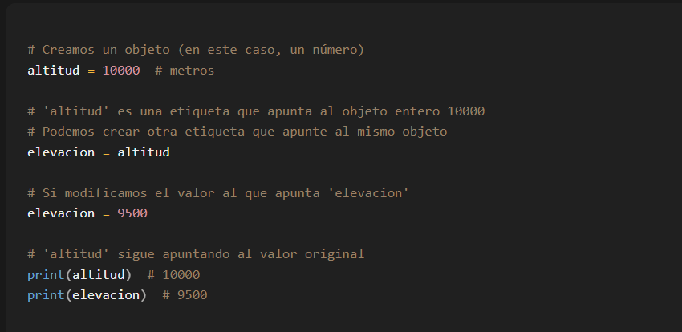
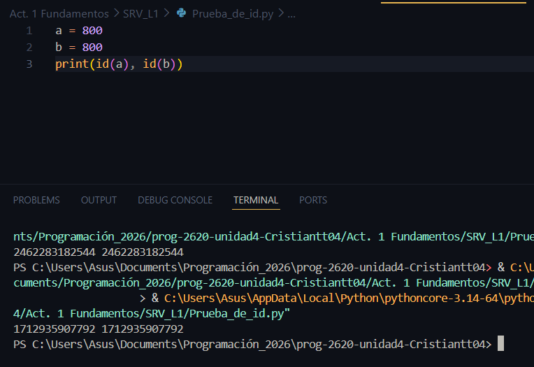
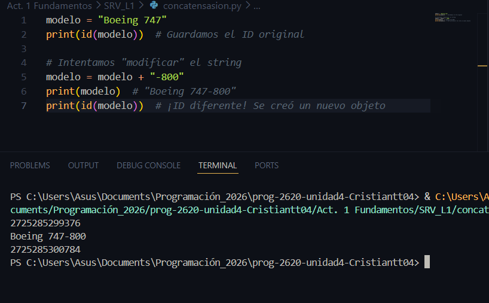
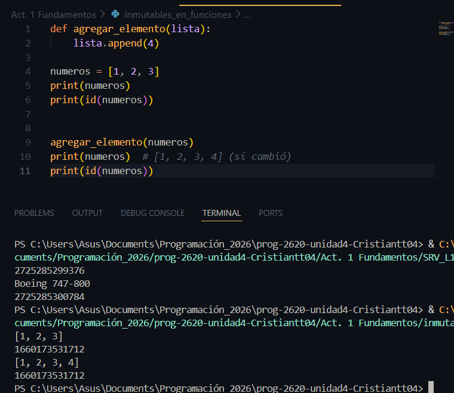
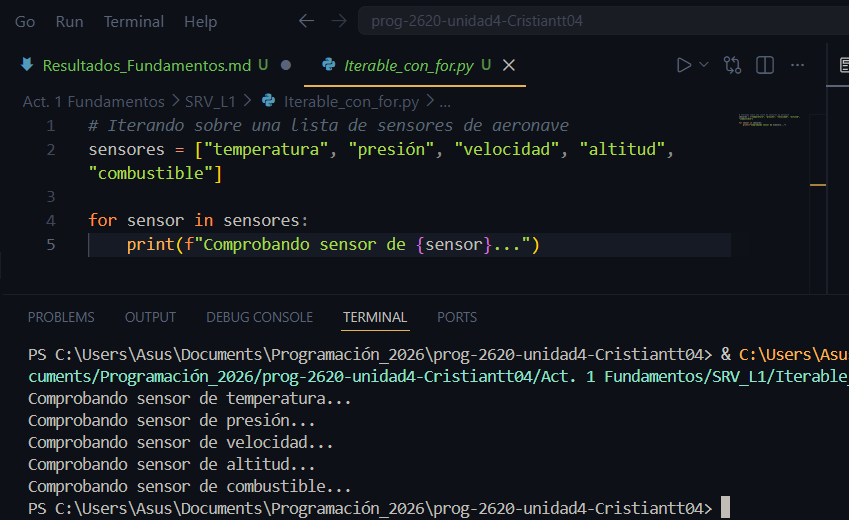
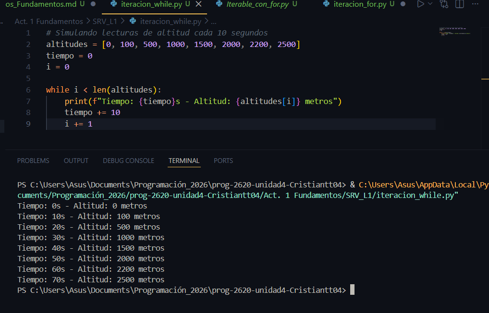
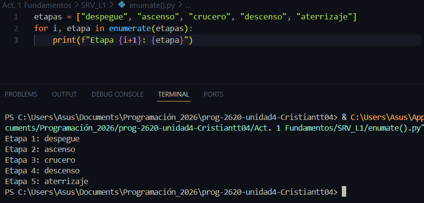
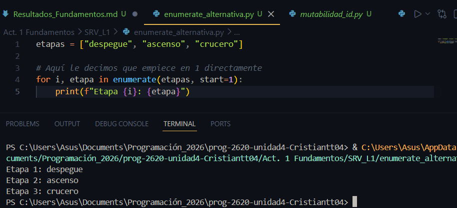

## Objetos, Variables y etiquetas. 

En python y otros lenguajes como Java, absolutamente todo es un objeto, las listas, diccionarios, funciones, variables, todos son un objeto los cuales cuentan con las siguientes caracteristicas: 
- **Datos** : Atributos como el valor de un número o los elementos de una lista.
- **Comportamientos** : Metodos como .append() en listas o .upper() en cadenas. 

### Las variables no son cajas, son etiquetas
En muchos lenguajes se piensa en una variable como una caja que guarda un valor. Pero **en python** una variable no es más que un nombre que apunta a un objeto en la memoria. 

### Reasignación no es lo mismo que modificación 

Cuando reasignas una variable, no cambia el objeto original, simplemente mueves la etiqueta a otro objeto. 

Por esta razón altitud seguia apuntando a 10000, cuando guardamos ese resultado en la variable elevacion y posteriormente cambiábamos su valor, lo que haciamos realmente es crear un nuevo objeto y apuntar la etiqueta a este. 
Es importante recordar que más de una etiqueta puede apuntar a un objeto. 

### Mutabilidad vs inmutabilidad 

- **Objetos inmutables** (enteros, cadenas, tuplas): No se pueden cambiar una vez creados, Si reasignas, en realidad creas un nuevo objeto y mueves la etiqueta. 
    - Las cadenas son strings, secuencias de caracteres, ya sean letras números, simbolos, lo que sea. 

    - Las tuplas, son colecciónes ordenadas de elementos, como una lista, pero inmutable, se escriben entre parentesis. 

## ID de objetos. 
Cada objeto en python tiene un identificador unico en memoria, que puedes consultar con la función id(). Ese identificador es como la "direccion" del objeto dentro de la memoria del programa. 

**Objetos simples:** python opyimiza el uso de memoria pra ciertos objetos pequeños e **inmutables** 
por eso si asignamos a dos variables valores iguales, estas muy probablemente tengan el mismo ID, como en este ejemplo. 

**Diferencia entre igualdad e identidad**    
Aquí es util recordar las funciones (==) y (is)

La primera compara si dos objetos apuntan al mismo contenido, y la segunda compara si dos variables apuntan al mismo objeto en memoria (id)

- En este ejemplo la concatensación la cúal es en palabras simples pegar texto uno detras del otro, en este caso el cual fue "-800" hace que la variable inicial [modelo = "boing 747"] quede inaccesible. 

    El ID de la primera version de modelo, y el de la segunda(post-concatenación) son distintos, este es un objeto inmutable, no es posible modificar este objeto sino que lo que pasa es que se crea otro objeto con un ID (ubicación en memoria) distinto. 

- Es aquí donde ya nos vamos acercando a la unidad el curso, extructura de datos, donde vemos objetos mutables como listas, diccionarios, conjuntos entre otros cuales comparten la caracteristica de poder agregar datos sin necesidad de crear un objeto nuevo, util ya que estos objetos estan enfocados para trabajar con grandes cantidades de datos dentro y es más eficiete poder agregar más datos al objeto ya existente que crear una copia del obejto para agregarle un nuevo elemento. 

## ¿Como afecta la mutabilidad a los objetos que se usan como argumentos de una función? 

1. Con **inmutables**, la funcion recibe una copia del objeto que ingresa en la funcion, y cualuquier cambio de este objeto hace que se genere un nuevo objeto. 

2. Con **mutables** la funcion recibe el objeto y cualquier cambio que haga la funcion en este se aplica al objeto como tal.

## Iterables e Iteración 

Un objeto iterable es cualquiera que podamos recorrer componente a componente, tecnicamente un iterable es cualquier objeto que implemente el metodo (__iter__()) o (__getitem__()) 

Aqui es clave entender la estructura del ciclo for y de como este es uno de los metodos más directos y comunes oara realizar iteraciones, es decir, para recorrer elementos de una lista o un objeto, uno a uno.    
primero en el ejemplo hay que reconocer los dos roles dentro del ciclo for, el de **sensor** y el de **sensores** 

Lo que hace python: 

1. Toma un elemento de **sensores** 
2. Lo guarda en **sensor**
3. Ejecuta el bloque de codigo 

En este caso se ve un ejemplo de una iteracion de una lista con el ciclo while, es menos comun y un poco más confuso pero aqui van los aspectos clave: 

1. Entender el uso de **Len**   
len() es una función de Python que devuelve la cantidad de elementos que tiene una estructura (lista, string, etc.).    
En ese caso Len = 8 ya que la lista cuenta con 8 elemntos, este metodo Len se usa para contar no solo elementos de una lista, sino tambien de string por ejemplo len("Hola") seria igual a 4, por el número de caracteres con los que cuenta la palabra Hola. 

2. Entender la condición: While i < Len(altitud):     
*Repite el ciclo mientras i sea menor a el número de elementos de la lista ""altitud* 

3. Entender el concepto de los indices.     
El ultimo indiice de la lista es 7, ya que estos empiezan desde cero en adelante, en este caso el i tiene más de una función, ya que este tambien dentro del bloque de codigo imprime los elementos de la lista de forma ordenanda partiendo del que esta en la posicion 1 en base al indice, es decir el que esta en la posicion 2. 

Es decir, hay 8 elementos en la lista, pero ordenados del 0 al 7 segun su indice, Len(altitud) es igual a 8, pero no hay un indice igual a 8, es decir, que por esa razon la condicion es menor que y no menor o igual. 

Este ciclo while se repite 8 veces partiendo de i = 0 para el indicie 0 de la lista hasta i = 7 para el indice 7 de la lista. 

## Funciones de iteración útiles

### enumerate() 
Prociona indices junto con valores. 

Es muy util por ejemplo en ciclos de tipo for para no tener que asiganr un contador, ya que esta función hace ese trabajo por ti, en objetos que podamos recorrer. 

En la línea for i, etapa in enumerate(etapas):, la función le asigna a i el número de la posición y a etapa el texto correspondiente.

#### Alternativa. 
Podemos asiganrle a este metodo de enumerate() el número por el que va a iniciar. 

 
En este caso al agregarle start=1 no hay que hacer el arreglo en la parte del print. recordar que las pociones en las listas empiezan desde el cero, segun en programación en general se empieza a contar desde el cero. 

## zip() 
Este es mucho más sencillo, lo que hace es juntar dos iterables, o solo listas, lo más probable es que tambien sea aplicable para diccionarios emtre otros. 

**Condiciones y caracteristicas:** 
- Si intentas unir una lista más grande que otra el comando zip() se detendra cuando la lista más pequeña llegue a su fin, ya que este comando lo que hace es organizar los datos de las dos o más listas en conjuntos con la misma posicion. 
- Puedes usar más de dos listas. 
