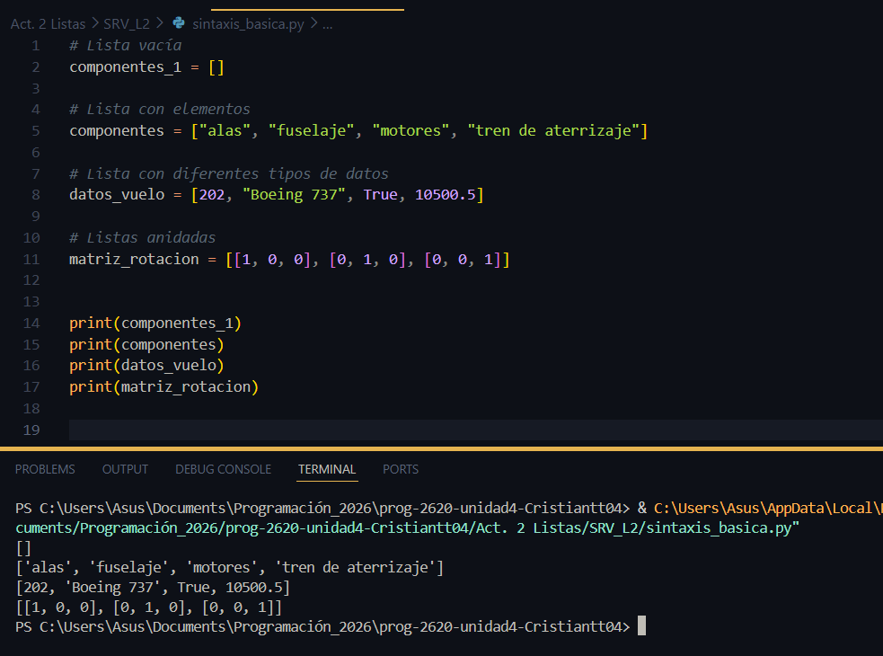

Las listas son colecciones ordenadas de elementos, son mutables y se pueden recorrer componente a componente. 

## Sintaxis basica

**¿Es posible crear listas que contengan diferentes tpos de datos?**

R// Sí, es totalmente factible, a diferencia de otros lenguajes de programacion, python permite crear listas donde los elementos dentro pueden ser diferentes unos de otros. 

**¿Una lista puede contener otra lista?**

R// Sí, a estas listas se les llama lista de listas, listas anidades o matrices, y es la forma en que python maneja estructura de datos más compleja. 

**¿Una lista es un objeto?** 

R// Sí, en python casi todo es un objeto. puede guardar datos y tiene metodos. por ejemplo: 

- lista.sort() ordenarse a sí misma. 

- lista.append() añadir algo al final. 

- lista.reverse() voltearse. 

### **.sort()** 

*¿En que sentido se ordena?* 

**De menor a mayor** si son números, si son letras se ordenan en forma alfabetica.  

Un tip es que si quieres organizar la lista de mayor a menor, usas *lista.sort(reverse=true)*

### **.reverse()** 

Es muy simple, ordena los elementos invirtiendo su orden original. 

### **.append()**

Sirve para añadir un elemento justo al final de la lista. 
